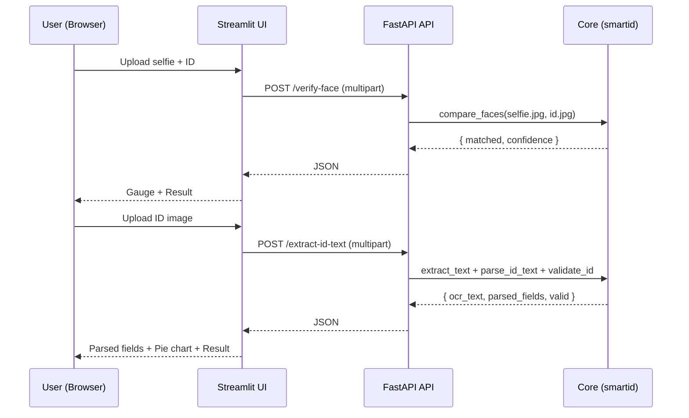

## Architecture Overview

This document explains how the system is organized and how data flows through the app.

### Components
- Streamlit UI (`frontend/app.py`) — presents two flows: Face Verification and ID Validation.
- FastAPI API (`api/main.py`) — exposes two endpoints: `/verify-face` and `/extract-id-text`.
- Core logic (`src/smartid/…`) — reusable modules for face embedding/similarity and OCR parsing/validation.

### High-level Flow
1. User uploads images in the UI
2. UI sends multipart form data to API
3. API saves temp images, runs the respective function, and returns JSON
4. UI displays results with charts and summary state

### Sequence Diagram

### Validation Modes
- `format_only` (default): check keys and regex patterns only
- `expected_file`: compare with values in `valid_sample_data.txt` if present
- `mock`: compare with generated mock values (for demo)

### Notes
- Tesseract path can be overridden with `TESSERACT_CMD`
- Face threshold adjustable via `SMARTID_FACE_THRESHOLD`

